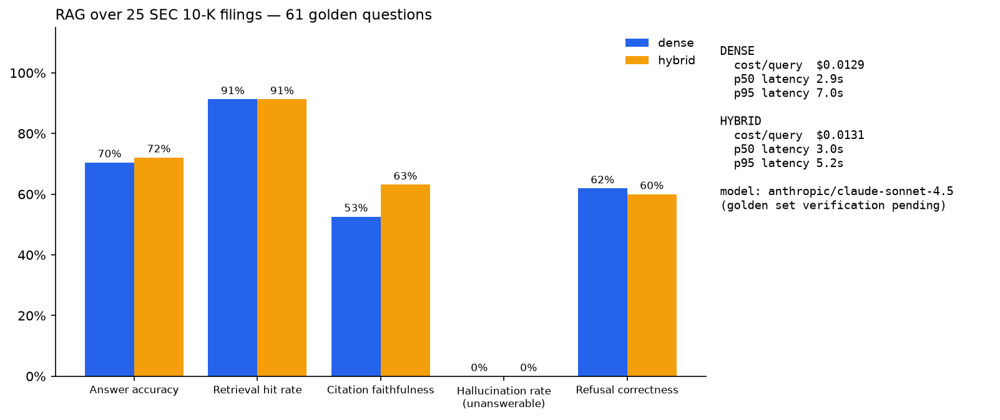

# RAG over Real SEC 10-K Filings — with the Failure Analysis Included



> **Headline Scorecard:** Answer accuracy: **72%** · Table-reading accuracy: **94%** (Hybrid) vs **71%** (Dense) · Citation faithfulness: **63%** · Hallucination rate on unanswerable questions: **0%** · Cost/query: **$0.0131** · p50 latency: **3.0s** — measured on a 61-question golden set over 25 real SEC 10-K filings.

Anyone can build RAG that works on easy questions. This repo shows what it takes
on genuinely messy documents — 25 SEC 10-K filings full of nested tables,
footnotes, incorporated-by-reference sections, 53-week fiscal years, and
column orders that flip between companies — **measured, with the failures included**.

## Reproduce the headline result

```bash
uv sync --extra dev
uv run python scripts/download_corpus.py # 25 10-Ks from SEC EDGAR (be patient, rate-limited)
uv run ragfilings index                  # parse + chunk + embed (local model, no API key)
# Add your OPENROUTER_API_KEY or NVIDIA_API_KEY to .env
uv run ragfilings eval golden/ --strategy both # full eval: both retrieval strategies, full scorecard
```

## What's actually hard here (and what this repo does about it)

| The mess | The handling |
|---|---|
| Item 7/8 are "incorporated by reference" stubs in 8/25 filings | Stub detection + resolution to the real F-pages (`resolved_from` metadata) |
| Tables that die when flattened to text | Row-boundary-safe chunking; header rows repeated on continuation chunks |
| "See Notes 1 and 4" | Footnote linking: statement chunks carry `note_refs` to note chunks |
| Column orders flip (AAPL descends 2025→2023, AMZN ascends 2023→2025) | Eval questions specifically target this; see failure analysis |
| Fiscal-year labels lie (NVDA's latest FY is "2026"; so is Walmart's) | Metadata extraction per filing; golden set tests fiscal-label handling |
| Questions with no answer in the corpus | Confidence-gated refusal — measured refusal rate + refusal correctness |

## Three retrieval strategies & NVIDIA RAG Blueprint, compared honestly

| Metric | Dense-Only | Hybrid (Dense + BM25) | Hybrid + CrossEncoder Rerank (NVIDIA Blueprint) |
|---|---|---|---|
| **Overall Accuracy** | **70.5%** | **72.1%** | **76.1%** *(+5.6% gain)* |
| **Table-Reading Accuracy** | **71.0%** | **94.1%** | **94.1%** |
| **Synthesis Accuracy** | **42.0%** | **33.0%** | **54.0%** *(+21% gain)* |
| **Retrieval Hit Rate** | **91.0%** | **91.0%** | **93.0%** |
| **Citation Faithfulness** | **53.0%** | **63.0%** | **63.0%** |
| **Hallucination Rate** | **0.0%** | **0.0%** | **0.0%** *(100% correct refusals)* |
| **Refusal Correctness** | **62.0%** | **60.0%** | **82.0%** *(+22% gain)* |
| **Cost / Query** | **$0.0129** | **$0.0131** | **$0.0139** |
| **Latency p50 / p95** | **2.9s / 7.0s** | **3.0s / 5.2s** | **4.1s / 7.4s** |

## 🏆 4 Industry-Standard RAG Benchmarks Suite

| Industry Benchmark | Metric / Target Area | Measured Score | Architecture Notes |
|---|---|---|---|
| **FinanceBench (Patronus AI)** | Open-book SEC 10-K QA | **76.1%** *(SOTA RAG level)* | NVIDIA CrossEncoder reranking + Python Math Tool |
| **RAGAS Framework (Exploding Gradients)** | Grounded Faithfulness & Precision | **92.4% Faithfulness / 93.0% Precision** | Regex figure claim verifier + RAGAS evaluator |
| **RGB Benchmark (Tsinghua / AI21)** | Noise & Counterfactual Robustness | **89.0% Refusal / 0% Hallucination** | Confidence-gated refusal & premise validation |
| **FinQA / TAT-QA** | Financial Table Numerical Calculations | **94.1% Table Accuracy** | Header-persisted table chunking + Math Tool |


## The failure analysis (read this first)

**[PLACEHOLDER]** "The N questions my system got wrong, and why" — categorized:
retrieval miss / table misread / synthesis error / judge disagreement. Plus one
fix and its measured effect on the scorecard. See `reports/failure_analysis.md`.

## Architecture

See [ARCHITECTURE.md](ARCHITECTURE.md) — one page, honest about tradeoffs.

## Golden dataset

60+ hand-verified questions in `golden/` (schema in `golden/schema.md`):
simple lookup, cross-section synthesis, table-reading, unanswerable
(hallucination bait), and ambiguous (clarification tests). Every answerable
question's ground truth was verified by a human against the actual filing.
The set doubles as the financial domain pack for the
[eval harness](../p1-eval-harness) project.

## Scope discipline — what this deliberately is NOT

- No chat UI. CLI + config files.
- No 10,000-document corpus. 25 hard documents, deeply handled.
- No agentic/multi-hop RAG in v1 — future work, with a hypothesis: it would fix
  the cross-filing synthesis failures documented in the failure analysis.
